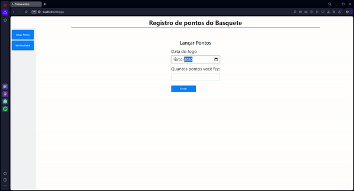

# Projeto de Registro de Pontuação

Este projeto é uma aplicação que permite o registro de pontuações de jogos, utilizando **C#** e **.NET** no backend e **Angular** no frontend, banco de dados em SQL Server. Feito para o teste prático da FagronTech.

---

## Tecnologias Utilizadas

- **Backend**: C#, .NET Core
- **Frontend**: Angular
- **Banco de Dados**: SQL Server
- **ORM**: EntityFramework
- **Teste Unitario**: XUnit

---

## Requisitos para Execução

Certifique-se de que os seguintes requisitos estão instalados em seu sistema:

- [.NET SDK](https://dotnet.microsoft.com/download)
- [Node.js](https://nodejs.org/)
- [Angular CLI](https://angular.io/guide/setup-local)

O Back-End processa na porta https://localhost:5093/api/jogo.
O Front-end processa na porta https://localhost:4200

# Demonstração

 

